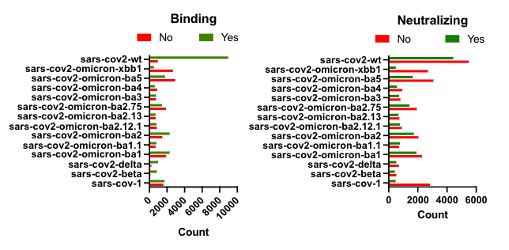

# Processed Dataset: 

	•	Dataset Source: CovAbDab, a database of annotated antibody sequences interacting with SARS-CoV-2 variants (WT, beta, delta, omicron).
	•	Antigen Similarity: Average sequence similarity between antigens = 0.96 (minor differences).
	•	Antibody Diversity: Average sequence similarity between antibodies = 0.53.
	•	Processing:
		•	Identified antibody-antigen binding and neutralizing pairs.
		•	Focused on antigens with ≥1,000 interacting antibodies, yielding 42,091 pairs.
		•	Variant Distribution: SARS-CoV-2 WT had the most antibodies.
	•	Labels:
		•	Binding and neutralizing.
		•	Binding but not neutralizing.
		•	Neither binding nor neutralizing (neutralizing without binding is impossible). 

	•	Contact Determination:
		•	Amino acids are considered in contact if the distance between their alpha carbon C_alpha atoms is < 8Å, per CASP guidelines.
	•	Antibody Structures:
		•	Dataset contained 10,386 antibodies; 2,237 had experimentally resolved 3D structures in PDB.
		•	Missing structures were predicted using ESMFold.
	•	Contact Map Generation:
		•	For each antibody, pairwise C_alpha distances were computed.
		•	Generated a binary |S| x |S| contact map for each antibody S, where (i, j) = 1 if residues S[i] and S[j] were in contact, otherwise (i, j) = 0.
		•	Process applied to both heavy and light chains of all antibodies.

# Processed Dataset Link:  

https://drive.google.com/file/d/1C4n2q7rBvR-B06P9ajOIjv6URUPGHO76/view?usp=sharing 