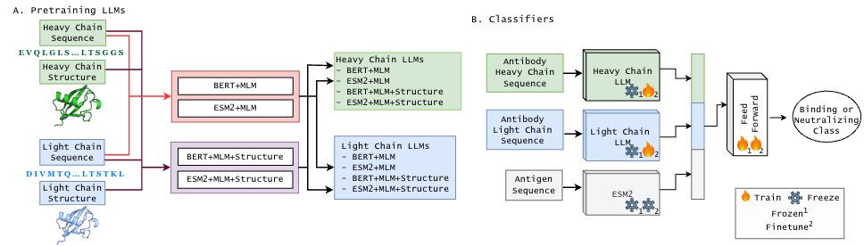

# Structure-Aware Large Language Model Improves Prediction of Antibody-Antigen Interaction 

This repository contains the code, datasets, and supplementary materials for our paper:  
<!-- **"[Paper Title]"**  
[Author Names]  

Published in [Conference/Journal Name, Year].   -->

<!-- ## Abstract  
[Include a brief summary of your paper's objectives, methods, and key findings.]   -->

## Repository Overview  

This repository is organized as follows:  

- `Classifiers/`: Source code for the implementation of the classifiers described in the paper.  
- `Data/`:  Processed dataset used in the experiments (or links to download them).  
- `Analysis/`: Precomputed results, plots, or outputs from the experiments.  
- `Pretrained LLMs/`: Code for pretrained LLMs and training.   

## Dependencies  

To run the code in this repository, you will need:  
- Python >= 3.10  
- Pytorch 

## Links

Model weights: https://drive.google.com/drive/folders/1dMgDxQBBu96BkU__pcSTETwHDre_CNOe?usp=sharing 

## Citation 

If you use this code or dataset in your research, please cite:

@article{your_paper,  
  title={Your Paper Title},  
  author={Your Name and Co-Authors},  
  journal={Journal/Conference Name},  
  year={Year},  
  pages={XX-XX},  
  doi={DOI Link}  
}  

